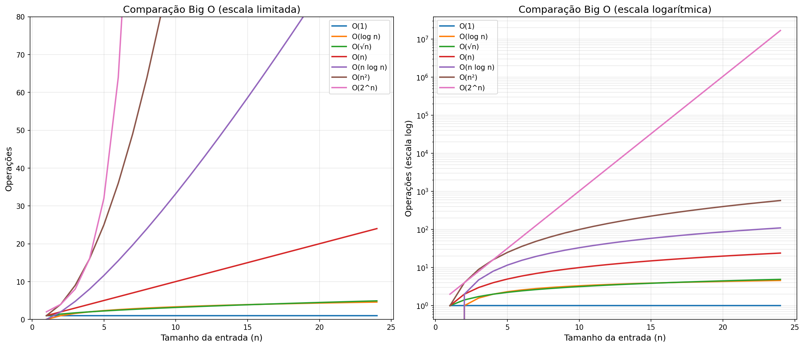

# Big O Analysis

Practice examples for Big O time and space complexity, organized by complexity class.

Each file contains one or more functions with the complexity analysis in the comments at the bottom.

Para uma introdução teórica e perguntas frequentes, veja o [FAQ](FAQ.md).

---

## Setup

Requires Python 3.8+ and `pipenv`.

```bash
pipenv install
```

To run any example:

```bash
pipenv run python o1_constant.py
```

---

## Examples

### O(1) — Constant
| File | Description |
|---|---|
| `o1_constant.py` | Odd/even check, first element access |

### O(log n) — Logarithmic
| File | Description |
|---|---|
| `ologn_halving.py` | Powers of 2, halving loop |
| `ologn_binary_search.py` | Binary search on a sorted array |

### O(√n) — Square Root
| File | Description |
|---|---|
| `osqrtn_prime_check.py` | Primality test — only checks divisors up to √n |

### O(n) — Linear
| File | Description |
|---|---|
| `on_linear.py` | Find max, return squares |
| `on_dropping_constants.py` | Shows why O(n/2 + 20) → O(n) |
| `on_prefix_sum.py` | Two approaches: O(n) space vs O(1) space |

### O(n log n) — Linearithmic
| File | Description |
|---|---|
| `onlogn_merge_sort.py` | Merge sort |

### O(n²) — Quadratic
| File | Description |
|---|---|
| `on2_nested_loops.py` | Simple nested loops; also shows O(n + n²) → O(n²) |
| `on2_bubble_sort.py` | Bubble sort |

### O(n²) Space — Quadratic Space
| File | Description |
|---|---|
| `on2_space_recursive_slicing.py` | O(n) time but O(n²) **space** due to list slicing |

### O(n³) — Cubic
| File | Description |
|---|---|
| `on3_nested_loops.py` | Three nested loops; innermost is O(1) constant |

### O(2^n) / O(3^n) — Exponential
| File | Description |
|---|---|
| `o2n_fibonacci.py` | Recursive Fibonacci — binary call tree |
| `o_exponential_recursive_calls.py` | 2-branch vs 3-branch recursion |

---

## Visualizations

Require `matplotlib`. Run with `pipenv run python <file>`.

| File | Description |
|---|---|
| `viz_comparison.py` | **Comparação de todas as curvas** em um único gráfico |
| `viz_constant.py` | Gráfico mostrando crescimento constante |
| `viz_linear.py` | Gráfico mostrando crescimento linear |
| `viz_nlogn.py` | Gráfico mostrando crescimento linearítmico |
| `viz_quadratic.py` | Gráfico mostrando crescimento quadrático |

---

## Da melhor à pior complexidade

**Melhores (crescem devagar — algoritmos eficientes):**
1. **O(1) — Constante:** não importa se a entrada tem 10 ou 10 milhões de itens, o tempo é o mesmo. Ex: acessar um elemento por índice.
2. **O(log n) — Logarítmica:** dobrar a entrada adiciona apenas 1 passo a mais. Ex: busca binária.
3. **O(√n) — Raiz quadrada:** para 1 milhão de itens, faz apenas ~1.000 operações. Ex: teste de primalidade.

**Intermediários (aceitáveis na maioria dos casos):**

4. **O(n) — Linear:** proporcional à entrada. 2x mais dados = 2x mais tempo. Ex: percorrer uma lista.
5. **O(n log n) — Linearítmica:** o melhor possível para ordenação por comparação. Ex: merge sort.

**Piores (crescem rápido — evitar quando possível):**

6. **O(n²) — Quadrática:** 2x mais dados = 4x mais tempo. Ex: bubble sort, dois loops aninhados.
7. **O(2^n) — Exponencial:** com n=30 já são ~1 bilhão de operações. Ex: Fibonacci recursivo sem memoização.

### Comparação visual



- **Gráfico da esquerda (escala limitada):** O(1), O(log n) e O(√n) ficam praticamente "coladas" no chão, enquanto O(n²) e O(2^n) explodem rapidamente.
- **Gráfico da direita (escala logarítmica):** permite ver a separação real entre todas as curvas — cada classe forma uma faixa bem distinta.

### Comparação prática (n = 1.000.000)

| Complexidade | Operações aproximadas |
|---|---|
| O(1) | 1 |
| O(log n) | 20 |
| O(√n) | 1.000 |
| O(n) | 1.000.000 |
| O(n log n) | 20.000.000 |
| O(n²) | 1.000.000.000.000 |
| O(2^n) | impossível de calcular |

---

## Big O Cheatsheet

https://www.bigocheatsheet.com/

## Python data structure complexities

https://www.ics.uci.edu/~pattis/ICS-33/lectures/complexitypython.txt
